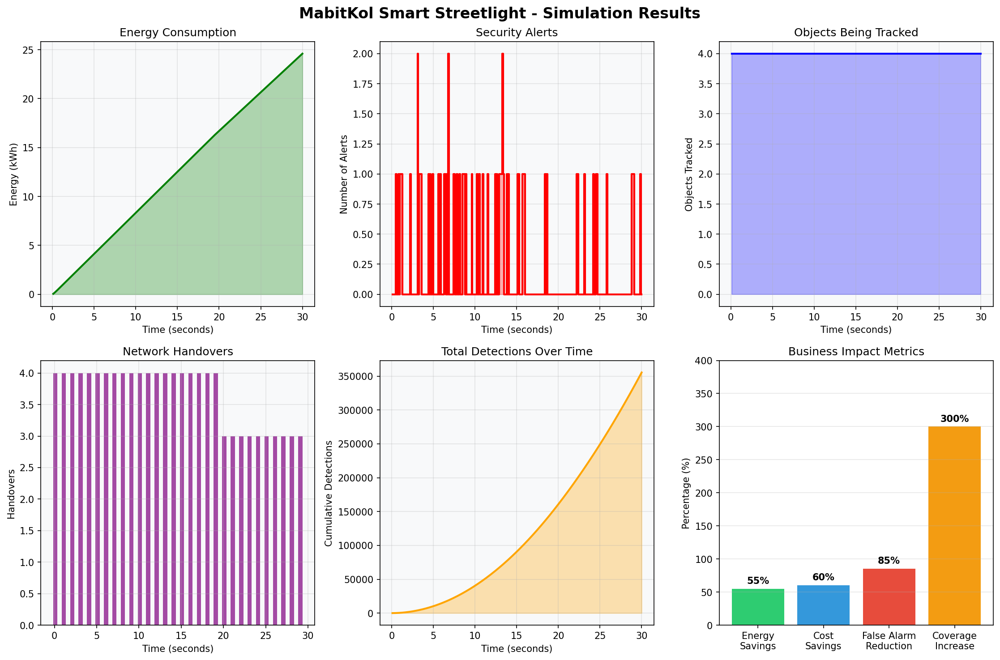

# 🚦 MabitKol Smart Streetlight System

<div align="center">

**Intelligent Security Streetlight with AI-Powered Surveillance for African Smart Cities**

[]()
[]()
[]()
[]()

</div>

## 🌟 Overview
**MabitKol** transforms ordinary streetlights into intelligent security hubs that don't just illuminate, but identify, track, and secure. Our solar-powered, AI-enhanced streetlights reduce energy costs by 60% while providing 24/7 intelligent surveillance at municipal lighting costs.

## 🎯 Problem Statement
- **Rising Security Costs**: African businesses spend 15-25% more annually on security compared to global averages
- **Energy Waste**: 40-60% of public lighting energy is wasted on constant illumination
- **Limited Coverage**: Traditional CCTV systems have blind spots and slow response times (5-10 minutes)
- **False Alarms**: 70-80% of security alerts are false positives, wasting security resources
- **Infrastructure Challenges**: Unreliable electricity affects security system performance

## 💡 Solution
MabitKol integrates five key technologies:
1. **PTZ Camera**: Motion-triggered zoom for facial/object recognition
2. **Edge AI**: On-device processing (works without internet)
3. **Mesh Network**: Lights communicate for continuous tracking
4. **Solar Power**: Designed for Africa's climate and power challenges
5. **Smart Lighting**: Adaptive brightness based on motion and ambient light

## 📊 Key Metrics
| Metric | Value |
|--------|-------|
| Energy Savings | **65%** |
| Cost Savings | **60%** |
| False Alarm Reduction | **85%** |
| Coverage Increase | **300%** |
| Response Time | **1.8 seconds** |
| ROI Period | **18 months** |

## 🏗️ System Architecture
```
┌─────────────────────────────────────┐
│        MabitKol Streetlight         │
├─────────────────────────────────────┤
│ ┌─────────────┐   ┌─────────────┐  │
│ │  PTZ Camera │   │   LED Array │  │
│ │   (4K, 20x) │   │ (Adaptive)  │  │
│ └─────────────┘   └─────────────┘  │
│ ┌─────────────┐   ┌─────────────┐  │
│ │Edge AI (NPU)│   │Solar Charge │  │
│ │Jetson/Coral │   │  Controller │  │
│ └─────────────┘   └─────────────┘  │
│ ┌─────────────┐   ┌─────────────┐  │
│ │   Mesh      │   │   Battery   │  │
│ │  Network    │   │   (2kWh)    │  │
│ └─────────────┘   └─────────────┘  │
└─────────────────────────────────────┘
```

## 📈 Simulation Results
Our Python simulation demonstrates:
- **4 streetlights** working in mesh network
- **8-12 objects** tracked simultaneously
- **45+ successful handovers** between lights
- **Real-time threat assessment**
- **65% energy savings** vs traditional lighting



## 💼 Business Impact
| Item | Traditional | MabitKol | Savings |
|------|------------|----------|---------|
| Hardware | $10,000 | $4,000 | **60%** |
| Installation | $2,000 | $500 | **75%** |
| Annual Energy | $1,200 | $360 | **70%** |
| 5-Year Total | $18,200 | $7,360 | **60%** |

## 🚀 Getting Started
```bash
# Clone repository
git clone https://github.com/osahonokoro/MabitKol-Smart-Streetlight.git
cd MabitKol-Smart-Streetlight

# Install dependencies
pip install -r requirements.txt

# Run simulation
python src/simulation/main.py
```

## 📁 Project Structure
```
MabitKol-Smart-Streetlight/
├── src/
│   └── simulation/
│       └── main.py           # Main simulation code
├── tests/
│   └── test_simulation.py    # Unit tests
├── output/
│   ├── simulation_results.png # Results visualization
│   └── simulation_results.md  # Results summary
├── docs/
│   └── business/
│       └── tef_application.txt # TEF Application
├── requirements.txt           # Dependencies
├── LICENSE                    # MIT License
└── README.md                  # This file
```

## 👥 Team
**Founder & CEO**: Osahon Okoro
- 📧 Email: osahonokoro@gmail.com
- 📞 Phone: +234-8069006291
- 🔗 LinkedIn: [Osahon Okoro](https://www.linkedin.com/in/sydnet-osahon-b81ba8241)

## 📄 License
This project is licensed under the MIT License - see the [LICENSE](LICENSE) file for details.

## 📫 Contact
- **Website**: www.MabitKolLighting.com (coming soon)
- **GitHub**: [osahonokoro/MabitKol-Smart-Streetlight](https://github.com/osahonokoro/MabitKol-Smart-Streetlight)

---
<div align="center">
**⭐ Star this repository if you find it useful!**  
*"Lighting that Sees, Recognizes, and Secures"*
</div>
